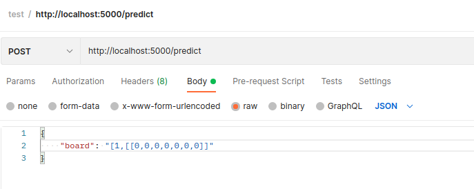

# connect-four-neuronal-network

TODO:

###Schnittstellen:

**1. Model trainieren**

Schnittstelle dir adressiert wird, und sich alle Spiele aus der Blockchain zu holen, um zu trainieren

- [x] Http Client bauen
- [ ] Nur gültige fertig gespielte Spiele holen

- [ ] Datensatz sieht wie folgt aus: [(1,[[0,0,0,0,0,0,0],[0,0,0,0,0,0,0],[0,0,0,0,0,0,0],[0,0,0,0,0,0,0],[0,0,0,0,0,0,0],[0,0,0,0,0,0,-1]]), (1,[[0,0,0,0,0,0,0],[0,0,0,0,0,0,0],[0,0,0,0,0,0,0],[0,0,0,0,0,0,0],[0,0,0,0,0,0,0],[1,0,0,0,0,0,-1]])]

Ein Array aus Tupel → Jedes Tupel besteht, dem Wert (links) der gewonnen hat, und dem Board zu dem Spielzug (rechts)

**2. Zug vorhersagen**

Schritte:
1[ ] Flusk als Web-Framework implementieren
2[ ] Player bauen und dem Model übergeben
3[ ] Aktuelles Board aus der Blockchain ziehen → statische Methode *get_available_moves*, die das Board als Parameter erhält
4[ ] *get_move* beim *Player* aufrufen mit → möglichen Zügen *available_moves* & dem aktuellen Board. Dort wird dann der beste Zug predictet.
5[ ] Dann *move* im *game* = Player im Board hinterlegen und auf die Blockchain packen.

**3. Model speichern**

1. [ ] Trainingsmodel bzw Gewichte speichern

**Getting Started**

1. Terminal -> ./start 

2. Postman

