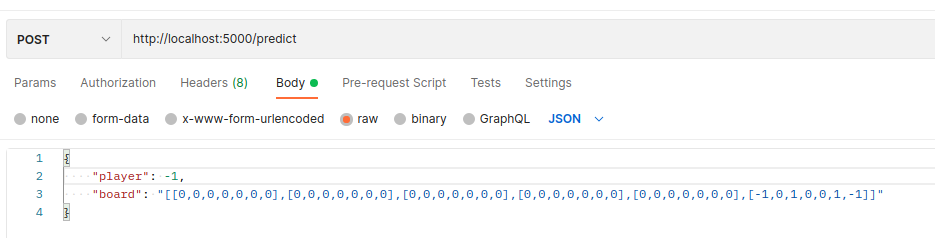
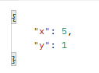

# connect-four-neuronal-network
###

**Service starten**

Um den Serice zu starten, muss folgender Befehl in der Konsole ausgeführt werden:

    ./start 
###
**Zug vorhersagen**

***Request***

Datensatz sieht wie folgt aus:
    
    player: 1
    board: [[0,0,0,0,0,0,0],[0,0,0,0,0,0,0],[0,0,0,0,0,0,0],[0,0,0,0,0,0,0],[0,0,0,0,0,0,0],[0,0,0,0,0,0,-1]]), (1,[[0,0,0,0,0,0,0],[0,0,0,0,0,0,0],[0,0,0,0,0,0,0],[0,0,0,0,0,0,0],[0,0,0,0,0,0,0],[1,0,0,0,0,0,-1]]

- Der Spieler wird als Integer `1` oder `-1` angegeben.
- Das Board wird als mehrdimensionales Array angegeben. Die `0` steht für ein unbesetztes Feld.

***Response***

Als Rückgabe wird mit `x` der Index der Reihe und mit `y` der Index der Spalte angegeben. 
Bei dem dann der Spielerwert, der als `player` mitgegeben wurde, (`1` oder `-1`) eingetragen werden kann.

###
**Model trainieren**

Um das Model zu trainieren, muss folgender Befehl in der Konsole ausgeführt werden:

    python3 train_command.py

Dabei werden die Daten aus der `trainingsdata.csv` verwendet. Nach Beendigung des Trainings wird das 
alte Model mit dem neuen ersetzt. Das Model befindet sich in dem Ordner `nn_model`.

###
**Model testen** 

Um das Model zu testen, muss folgender Befehl in der Konsole ausgeführt werden:

    python3 test_command.py

Nach Durchführung der Testspiele werden die Boards der letzten 20 % der Spiele in die `trainingsdata.csv` geschrieben.

