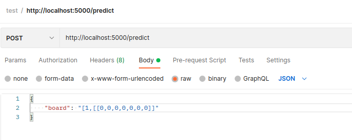

# connect-four-neuronal-network

TODO:

###Schnittstellen:

**Zug vorhersagen**

- [x] Flusk als Web-Framework implementieren
- [ ] *get_available_moves*, die das Board als Parameter erhält
- [ ] *get_move* beim *Player* aufrufen mit → möglichen Zügen *available_moves* & dem aktuellen Board. Dort wird dann der beste Zug predictet.
- [ ] Dann *move* im *game* = Player im Board hinterlegen und auf die Blockchain packen.

###Getting Started

**Service starten**

    Terminal -> ./start 

Postman

**Model trainieren** 

    Terminal -> python3 src/train_command.py

**Model testen** 

    Terminal -> python3 src/test_command.py